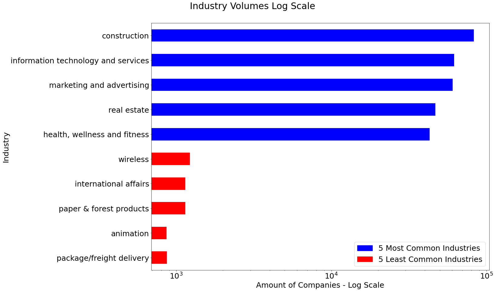

# Restoring Balance to the Universe
### Balancing datasets using T5
***By Eitan Bentora & Dvir Lafer***
 
This is a guide to use 3 different methods in order to overcome imbalanced **text** datasets:
1. Undersampling - Randomly selecting records from every industry we want to undersample and removing all others (up to a certain percentile).
2. Oversampling - Randomly selecting records (with replacements) from the smaller classes.
3. Generative model - Training a T5 model for every rare class in the dataset.
We will use those models to generate new records for every class using different inputs which are based on real texts from the class.
 

### The Data 
<ins>The dataset:</ins> For this discussion we will use a dataset composed from HTML home pages of different websites, classified to industries based on their linkedin page.
 

<ins>A snippet of the original dataset::</ins>
 

 

**<ins>EDA:</ins>** Since the dataset is composed of 147 classes and more than 1.7 million records, we chose to focus on 10 classes:
* 5 of the most frequent classes.
* 5 of the least frequent classe s among those that have more than 1K records.

**We can see the huge imbalance in the following image:**

 

### Preprocessing
Our preprocess included the following stages:
1. Separating words that were wrongly concatenated, probably due to scraping, e.g.: RetailBusiness -> Retail Business.
2. Removing every character which is not an english letter, a number or one of the following punctuation marks: `['(', ')', '-', '.', ':', ',', '?', '&']`.
3. reducing multiple spaces to a single space.
4. reducing multiple dots to a single dot.
5. removing tags that remained from html.
6. removing the first sentence and last 2 sentences from the texts because the usually contained HTML garbage (e.g.: copyrights, dropdown menu etc.)
7. Transforming the dataset into a format which is used by [fasttext for text classification](https://fasttext.cc/docs/en/supervised-tutorial.html) library.
 

### T5 Fine Tuning
In order to perform fine-tuning for [T5 model by HuggingFace](https://huggingface.co/docs/transformers/model_doc/t5), we first needed to adapt the given data into a fill-in-the-blank task (the original T5's pre-training task):
 

 
This adaption was done using the `create_labeled_data.py` script.
 
Once we have the adapted data, we performed fine-tuning to the pre-trained T5 (we used `t5-base`).  
The fine-tuning was done using `fine-tuning.py`.

### T5 Text Generation
* In order to generate text using T5, we used the following input structure: `"summarize: <industry name>. <input>"` and then tokenized it using T5 Tokenizer.  
* In order to create rich generated text (with different contexts) we created a list of different inputs"
  * We used the script `creating_generator_input.py` in order to create the input for our text generator.
  * Note that this script uses two files: `kw_per_ind.pkl` & `sentences_per_ind.pkl`. The first file is composed of selected keywords per industry (i.e. class), and the second file is composed out of randomly selected sentences per industry.
  * To finalize the creation of the input, we chose with probability of 0.5 an input based on 2 random keywords, and with probability of 0.5 input based on 1 random sentence.
* Using each input as described above, we generated texts per industry using `generate_per_ind.py`
* Note that since the models were fine-tuned per industry, each of the generation process used a different model specific to the industry.

### Comparing the methods
In order to evaluate which method resulted in a better model w.r.t rare industries, we used several metrics:
1. F1-Micro.
2. F1-Macro.
3. F1-Weighted.
4. Recall per industry = $\frac{TruePositive}{TruePositive + FalseNegative}$

Those methods are being compared in `Framework.ipynb` notebook as we will explain in the next section.

### Reproduction
* Note that all scripts and notebooks have hard-coded paths, if you want to reproduce with different dataset or setup you should change those paths.
1. Run `preprocess.py`.
2. Run `T5/fine_tuning_T5/create_labeled_data.py`.
3. Run `T5/fine_tuning_T5/fine_tuning.py`.
4. Run `T5/creating_generator_input.py`.
5. Run `T5/generate_per_ind.py`.
6. Run all cells in `Framework.ipynb` and watch the magic happen (Specifically the last cells comparing the metrics mentioned above).

